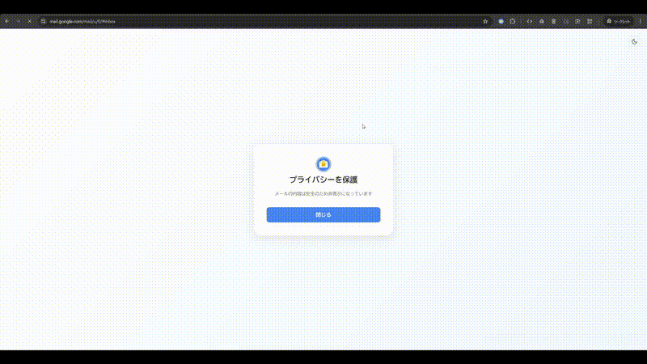

<div align=center>
	
</div>

<div align=center>
	<h1>Gmail Privacy Protection</h1>
</div>

## 概要

Gmailのプライバシーを保護するためのChrome拡張機能です。

メール内容を一時的に非表示にし、必要なときのみ表示することで、画面共有時や人の目が気になる環境でのGmailの利用をより安全にします。

<div align="center">
  
</div>

## 機能

- プライバシー保護

  - クリックまたはパスワードによる保護解除
  - 自動再開機能（離脱時、タイマー）

- カスタマイズ
  - ダークモード／ライトモードの切り替え
  - 保護解除方法の選択（クリック／パスワード）
  - 自動再開のタイミング設定

## 技術スタック

- 🚀 TypeScript
- 🚀 Chrome Extensions API
- 🚀 Node.js

- 📦 lodash
- 📦 type-fest

- 🛠️ esbuild
- 🛠️ ESLint
- 🛠️ Prettier

> **💡 crxjsなどの実績のあるツールへの移行を検討中**

## システム要件

- Chrome バージョン 88.0 以上
- Node.js 18.0.0 以上
- npm 8.0.0 以上

## プロジェクト構成

```
.
├── sources/ # ソースコード
│   ├── components/
│   ├── features/
│   │   ├── control/
│   │   └── overlay/
│   ├── constants/
│   ├── definitions/
│   ├── exceptions/
│   ├── utilities/
│   └── entries/
└── distributions/ # ビルド成果物
    ├── assets/
    ├── content/
    └── popup/
```

## 主要なコンポーネント

- `Overlay`：メール内容を非表示にするオーバーレイコンポーネント
- `Control`：拡張機能の設定を管理するポップアップコンポーネント
