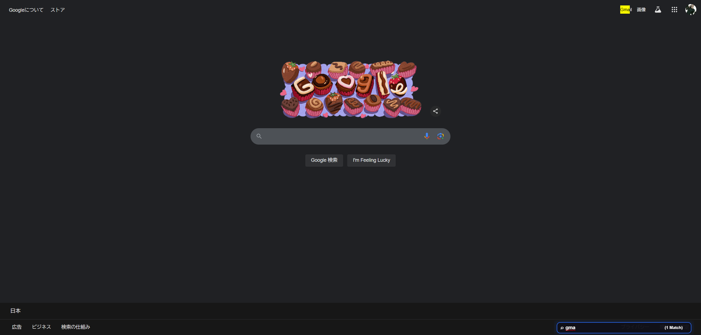

# Vimium 設定ファイル

## 概要

[Vimium](https://github.com/philc/vimium)に関連する設定ファイルです。

リファクタリングするのを後回しにしたいので、ミニファイ用のスクリプトを用意しています。

## スタイル

[dark.css](dark.css)

[dark.min.css](dark.min.css)

### Hint Marker


### Vomnibar


### HUD



## キーマップ

```
unmapAll

### ページ内検索 ###
# enterFindMode = 検索モード開始
# performFind = 次の検索ヒットに進む
# performBackwardsFind = 前の検索ヒットに戻る
map <c-f> enterFindMode
map / enterFindMode
map ' performFind
map ; performBackwardsFind

### 検索エンジン ###
# Vomnibar.activate = 検索エンジンを開く
# Vomnibar.activateInNewTab = 検索エンジンを開く（新しいタブ）
map o Vomnibar.activate
map <c-o> Vomnibar.activateInNewTab

### リンクマーカー ###
# LinkHints.activateMode = ページ内リンクを表示する
map f LinkHints.activateMode

### スクロール ###
# scrollUp = 上へ
# scrollDown = 下へ
# scrollToTop = 一番上へ
# scrollToBottom = 一番下へ
map <c-up> scrollUp
map <c-down> scrollDown
map tt scrollToTop
map bb scrollToBottom

### 入力 ###
# focusInput = 入力要素にフォーカス
map i focusInput

### ページ遷移 ###
# goBack = 一つ前のページに遷移
# goForward = 一つ後のページに遷移
map <c-left> goBack
map <c-right> goForward
```

## 検索エンジン

```
wiki: https://www.wikipedia.org/w/index.php?title=Special:Search&search=%s Wikipedia
zenn: https://zenn.dev/search?q=%s Zenn
qiita: https://qiita.com/search?q=%s Qiita
youtube: https://www.youtube.com/results?search_query=%s Youtube
maps: https://www.google.com/maps?q=%s Google maps
amazon: https://www.amazon.co.jp?k=%s Amazon
rakuten: https://search.rakuten.co.jp/search/mall/%s 楽天
deepl-en: https://www.deepl.com/ja/translator#en/ja/%s DeepL-英語から日本語
deepl-ja: https://www.deepl.com/ja/translator#ja/en-us/%s DeepL-日本語から英語
```

## 使用方法

1. [Vimium](https://chrome.google.com/webstore/detail/vimium/dbepggeogbaibhgnhhndojpepiihcmeb)を Chrome にインストール
2. Vimium の設定を開く（拡張機能のオプションから）
3. `Custom key mappings`にキーマッピング設定をコピー
4. `Custom search engines`に検索エンジンの設定をコピー
5. `CSS for Vimium UI`に CSS の内容をコピー
6. 変更を保存して再読み込み
